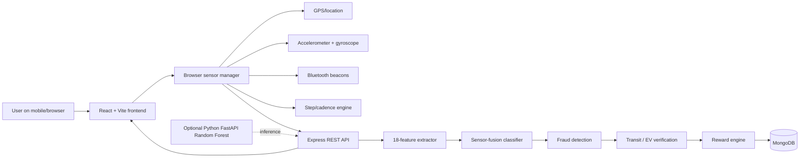
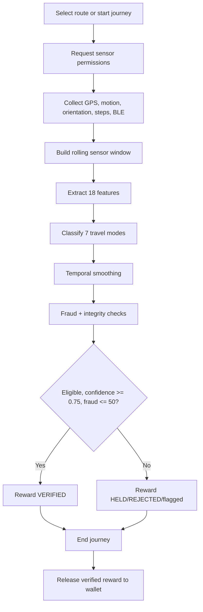
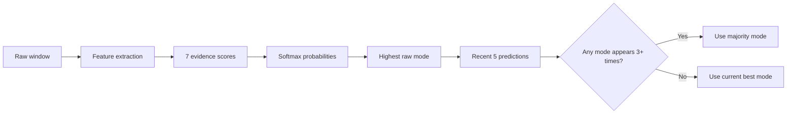
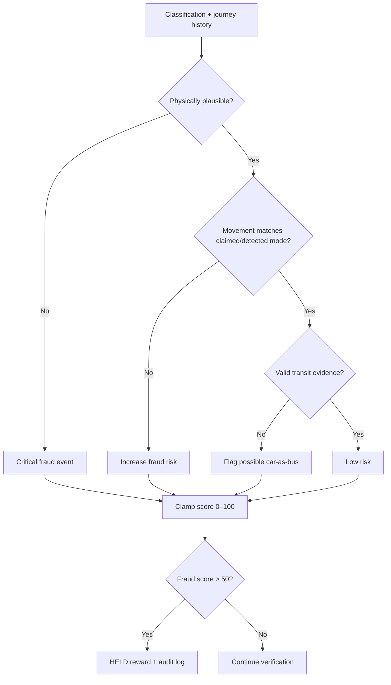
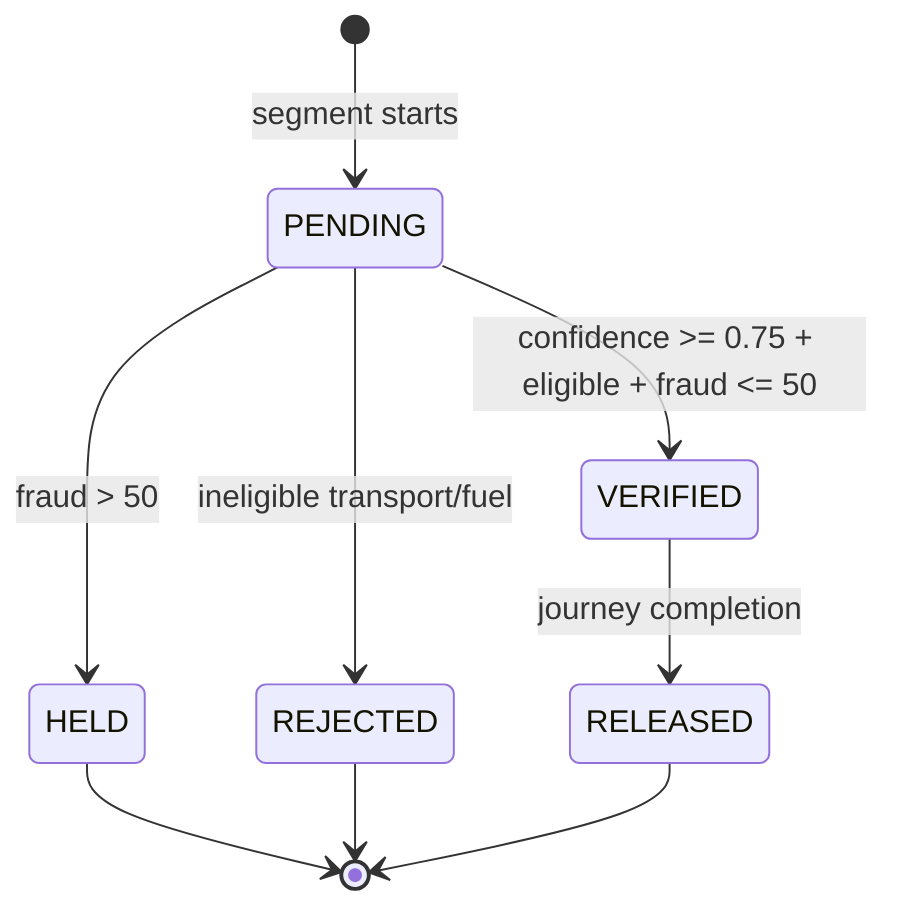

# EcoMiles / Green Credit Platform — Presentation Guide

## What the website does

**Presentation opening**

> EcoMiles is an AI-assisted smart mobility platform that makes sustainable travel measurable and trustworthy. It detects whether a user is walking, cycling, travelling by bus or metro, driving a car, riding a scooter, or stationary. It then awards Green Credits and Fitness Points only after the journey evidence passes verification and fraud checks.

### Problem and solution

- GPS-only rewards are easy to abuse: a scooter travelling at cycling speed may look like a bicycle.
- Selecting a travel mode manually is not evidence.
- EcoMiles combines multiple device signals, public-transport evidence, and anti-fraud logic before releasing rewards.

**One-line summary:** EcoMiles uses multi-signal sensor fusion to verify sustainable travel and reward it fairly.

## Website modules

| Module | Function |
|---|---|
| Smart Route Planner | Compares active multimodal, cycling, and car route options with time, fitness, carbon, and reward trade-offs. |
| Journey Tracker | Collects GPS, motion, orientation, steps/cadence, and Bluetooth evidence during a journey. |
| AI Mobility Verification | Classifies walking, cycling, bus, metro, car, scooter, or stationary. |
| Public Transport Hub | Uses corridors, stop/dwell patterns, routes, tickets, and BLE beacons to strengthen bus/metro verification. |
| EV Registration | Validates an Indian plate, uses a configured vehicle provider, identifies fuel type, and supports EV binding. |
| Rewards Marketplace | Shows Green Credits and Fitness Points and supports redemption. |
| City Transport Network | Displays transport infrastructure context such as corridors, stops, and trusted beacons. |
| Multilingual UI | Supports English and several Indian languages. |

## Architecture



**Say this:**

> The frontend is built with React and browser hardware APIs. A sliding telemetry window is sent every five seconds to the Node/Express backend. The backend extracts movement features, classifies the travel mode, checks fraud and transit evidence, then stores the journey and reward state in MongoDB. The repository also includes an optional Python Random Forest inference service.

### Technology stack

- Frontend: React, Vite, Leaflet, Geolocation, DeviceMotion, DeviceOrientation, Web Bluetooth.
- Backend: Node.js, Express, JWT, Helmet, CORS, REST APIs.
- Database: MongoDB/Mongoose.
- ML: Python, scikit-learn, Random Forest, FastAPI, NumPy, joblib.
- Integrations: pluggable vehicle-registration and metro/ticket providers.

## Complete journey flow



> The platform is verification-first: a reward is not immediately added to the wallet. It begins as pending, is verified only after sufficient evidence, and is released when the journey ends.

## Input signals and features

The backend converts each sliding window into an 18-value feature vector.

| Group | Features | Why it matters |
|---|---|---|
| GPS kinematics | average/maximum speed, speed variance, GPS acceleration RMS, heading-change rate, stop frequency | Separates walking, road travel, stop-go buses, and high-speed rail |
| Accelerometer | magnitude mean/variance, RMS, mean jerk, peak frequency | Captures step impacts, cycling rhythm, cabin smoothness, vibration |
| Gyroscope | magnitude mean/variance/RMS | Captures turning and body/vehicle stability |
| Activity | cadence | Separates steps/pedalling from motor travel |
| Transit context | corridor overlap, dwell-time ratio, BLE proximity | Supplies independent bus/metro evidence |

### Key algorithms

Dynamic acceleration removes gravity:

```text
dynamicAcceleration = |sqrt(x² + y² + z²) − 9.81|
```

Movement intensity uses RMS:

```text
RMS = sqrt(sum(xᵢ²) / n)
```

Mean jerk measures rapid/rhythmic acceleration change:

```text
meanJerk = average(|aᵢ − aᵢ₋₁| / Δt)
```

GPS spoofing checks use the Haversine distance between consecutive locations and derive implied speed from distance/time.

## Core AI module

### Live classifier: explainable sensor fusion

The Node journey backend uses a transparent evidence-scoring classifier for seven modes. It starts every mode with a small prior, adds scores for matching evidence, and converts the final scores into probabilities with softmax.

| Mode | Typical evidence |
|---|---|
| Walking | Low speed, step/cadence evidence, rhythmic acceleration |
| Cycling | 8–28 km/h, pedal cadence, human jerk |
| Scooter | Medium speed, zero cadence, low human jerk, weak transit evidence |
| Bus | Transit corridor plus stop/dwell or BLE beacon evidence |
| Metro | High/linear speed plus rail context, metro BLE, or degraded underground GPS |
| Car | Sustained road speed, few stops, no transit beacons |
| Stationary | Near-zero speed and absent cadence |

```text
P(modeᵢ) = exp(scoreᵢ) / Σ exp(scoreⱼ)
```

### Temporal smoothing



The system holds up to five predictions per journey. A mode appearing at least three times becomes the smoothed result, which avoids a wrong mode switch due to one noisy reading.

### Trainable ML module

The project also includes an optional Random Forest pipeline:

- Seven labelled classes: walking, cycling, bus, metro, car, scooter, stationary.
- Stratified 75/25 train/test split.
- Random Forest: 100 trees, maximum depth 10, balanced class weights, fixed random state.
- Reports accuracy, precision, recall, F1, confusion matrix, and feature importance.
- Saves a joblib model and exposes a FastAPI `POST /predict` endpoint.
- Can export decision trees as JSON for future native Node inference.

**Accurate presentation statement:**

> The project includes two AI layers: the currently wired live Node classifier is explainable sensor fusion with softmax probabilities and time smoothing; the repository additionally provides a trainable Random Forest/FastAPI service. This gives transparent real-time decisions and an upgrade path to model-based inference.

Do not say that the Random Forest is already driving the Express journey endpoint unless that endpoint is connected to FastAPI.

## Anti-fraud system



| Check | Rule in simple terms | Outcome |
|---|---|---|
| Fast walking/no steps | Walking at >8.5 km/h with fewer than 25 steps | Blocks vehicle travel claimed as walking |
| Phone shaking | >250 steps but <20 m displacement | Blocks fake step farming |
| No walking pattern | Travel distance with almost no acceleration/jerk | Blocks passive travel claimed as walking |
| Scooter as cycling | 10–28 km/h, zero cadence, low jerk/RMS, cycling classification | Prevents cycling-credit farming |
| Car as bus | Car profile on corridor without stops, dwell, or BLE | Prevents bus reward abuse |
| Impossible acceleration | >8 m/s² GPS RMS or individual >15 m/s² | Flags injected sensor data |
| Impossible speed | >140 km/h | Flags unrealistic urban movement |
| Teleportation | Large quick GPS jump and implied speed >200 km/h | Flags location spoofing |

Risk is capped from 0–100: 0–20 low, 21–50 medium, 51–75 high, 76–100 critical. Above 50, a reward is held rather than paid. The system stores the fraud evidence and action for audit.

## Public transport and EV logic

### Public transport

It independently verifies transit using:

1. A match to an active trusted BLE beacon.
2. A bus-like stop and dwell pattern.
3. High-speed linear rail movement, especially with rail corridor or tunnel/GPS-degradation context.

Transit is confirmed above 0.80 confidence.

### EV

1. Normalize the plate, e.g. `mh-12 ab 1234` becomes `MH12AB1234`.
2. Validate Indian state and Bharat-series formats.
3. Call the configured vehicle provider.
4. Determine electric/non-electric/unknown fuel status.
5. Mask owner identity before showing it.
6. Optionally bind the verified EV through Bluetooth; losing verification can pause eligibility.

## Reward logic



| Verified mode | Green Credits | Fitness Points | CO₂ method |
|---|---:|---:|---|
| Walking | 10/km | 1 per 75 verified steps; fallback distance/time estimate | compared with 0.192 kg/km ICE-car baseline |
| Cycling | 12/km | distance/time formula | same car baseline |
| Bus | 6/km | 0 | car baseline minus 0.05 kg/km bus factor |
| Metro/train | 8/km | 0 | car baseline minus 0.02 kg/km metro factor |
| EV | 5/km | 0 | 0.12 kg/km avoided factor |
| Car, scooter, fossil fuel, stationary | 0 | 0 | no reward |

> Green Credits represent lower-carbon mobility. Fitness Points represent human physical activity, so bus and metro can earn Green Credits but not Fitness Points.

## Data, security, and reliability

### Important data records

- User wallet and authenticated profile.
- Journey and multi-segment journey data.
- Sensor windows and latest telemetry.
- Verification events.
- Fraud events and evidence.
- Reward transactions and lifecycle status.
- Vehicles, transit routes/stops, stations, tickets, and beacons.

### Design safeguards

- JWT-protected user actions, Helmet headers, CORS, and request-size limits.
- The backend—not the browser—calculates confidence, fraud score, eligibility, and rewards.
- Sensors are permission based.
- Unavailable sensors are reported honestly; the app does not fabricate readings.
- Developer test mode replays labelled profiles through the same backend workflow.
- A journey deletion API supports privacy control.

## Best live demo

1. Show Smart Route Planner and compare active multimodal, cycling, and car routes.
2. Select a route and open Journey Tracker.
3. Use real mobile sensors or the walking replay profile; show live evidence, confidence, probabilities, and explanation.
4. Switch to cycling; point out cadence and active motion.
5. Use the scooter-fraud profile; show why cycling reward is denied.
6. Show bus/metro evidence: stop pattern, corridor, and beacon.
7. End the journey; show verified reward release.
8. Open the Rewards page, then optionally demonstrate EV registration.

## 2–3 minute speaking script

> Good morning. Our project is EcoMiles, a smart mobility and Green Credit platform. It encourages walking, cycling, public transport, and verified EV use, but it also makes sure that the rewards are fair.
>
> A normal reward application may only ask the user to choose cycling or check GPS speed. That is weak because a scooter travelling at cycling speed can appear to be a bicycle. EcoMiles solves this using multi-signal verification.
>
> When the user begins a journey, we collect permission-based GPS, motion, orientation, cadence, steps, and Bluetooth beacon data. Every five seconds, the backend extracts 18 features such as speed, speed variance, acceleration RMS, jerk, stop frequency, cadence, transit corridor overlap, dwell time, and beacon proximity.
>
> The live system uses an explainable sensor-fusion classifier. It evaluates seven modes—walking, cycling, bus, metro, car, scooter, and stationary—then converts the evidence scores into probabilities using softmax. It also smooths predictions over time, so a single noisy GPS sample does not wrongly change the mode. We additionally provide a Python Random Forest and FastAPI module for trainable ML inference and evaluation.
>
> The trust layer is our key contribution. The fraud engine checks whether all signals are physically consistent. It can detect scooter-as-cycling attempts, fake step shaking, car-as-bus behaviour, impossible acceleration, and GPS teleportation. If risk is high, the reward is held and the evidence is logged.
>
> Finally, rewards pass through pending, verified, and released states. Credits are paid only after eligibility, confidence, and fraud checks. Walking and cycling gain sustainability and fitness rewards, public transport earns Green Credits, and private cars or scooters earn no reward.
>
> Therefore EcoMiles is not simply a route planner. It is a transparent, AI-assisted platform that connects sustainable mobility, fraud prevention, and real incentives.

## Viva questions

**Is it really AI?**

> It is not GPS-only. The live engine performs explainable sensor fusion using GPS, acceleration, jerk, cadence, gyroscope, corridor, dwell, and BLE evidence; it produces softmax probabilities and applies time smoothing. The repository also includes a trainable Random Forest service.

**Why Random Forest?**

> It works well with tabular sensor features, captures non-linear interactions such as speed plus cadence plus jerk, handles noise, supports class weighting, and gives feature importance.

**How do you detect scooter versus bicycle?**

> Their speeds can overlap, so we do not use speed alone. Cycling should show pedal cadence and human movement/jerk. A scooter commonly shows zero cadence and low human jerk. The classifier and fraud engine combine those signals and can hold the reward.

**What if sensors are unavailable?**

> The app explicitly reports that limitation and continues with trustworthy available evidence; it never invents a live sensor value.

**What are current limitations?**

> Transit corridors and beacons are demo/seeded unless connected to city sources. Browser Bluetooth varies by device. Accuracy must be validated with consented field data. The Random Forest service is present but is not yet directly called by the live Express journey path.

## Future work

- Connect Express directly to the trained model service or evaluate exported JSON trees in Node.
- Train with diverse, consented real-world data and report held-out accuracy/F1.
- Integrate authoritative GTFS transit data, route geometry, schedules, and beacons.
- Add drift monitoring, retraining, stronger privacy controls, encrypted telemetry, and calibrated local emissions factors.

## Closing slide

**EcoMiles combines route planning, live sensor data, explainable AI, optional machine learning, transit/EV verification, anti-fraud checks, and controlled reward release to make sustainable mobility incentives credible.**

